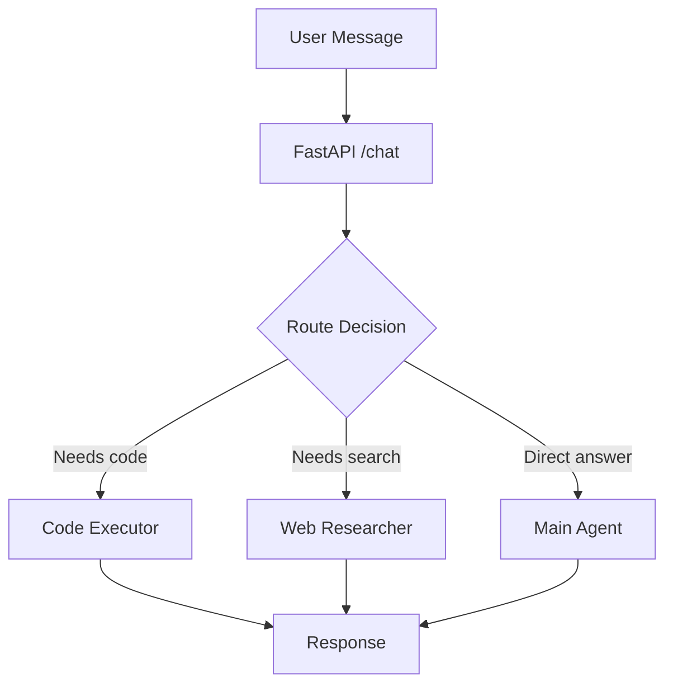

# Rendering Stack — Setup & Wiring

## Install

```bash
# Frontend
npm install mermaid marked dompurify

# Backend — nothing new needed (already in your stack)
```

---

## How it fits into Agent Ochuko

```
User message
    │
    ▼
FastAPI /chat
    │  injects build_system_prompt() on every call
    │
    ▼
Azure AI Foundry (your agent)
    │  agent knows: can output mermaid, svg, markdown, route to sub-agents
    │
    ▼
Response text (may contain ```mermaid, <svg>, , markdown)
    │
    ▼
Frontend ResponseRenderer.jsx
    │
    ├── ```mermaid block   →  mermaid.render()  →  inline SVG in DOM
    ├── <svg>...</svg>     →  DOMPurify.sanitize()  →  dangerouslySetInnerHTML
    ├──   →    →  displayed inline
    ├── ```python ...```   →  <pre> with copy button
    └── everything else   →  marked.parse()  →  HTML prose
```

---

## Wire ResponseRenderer into your chat UI

```jsx
// ChatMessage.jsx
import { ResponseRenderer } from "./ResponseRenderer";

export function ChatMessage({ role, content }) {
  if (role === "user") {
    return <div className="user-msg">{content}</div>;
  }
  // Agent response — run through renderer
  return (
    <div className="agent-msg">
      <ResponseRenderer text={content} />
    </div>
  );
}
```

---

## How the agent self-awareness works

Claude (and Agent Ochuko after this) knows its capabilities through one mechanism: **the system prompt**.

There is no magic. The model reads the system prompt on every request. If the system prompt says "you can output mermaid diagrams," the model will output mermaid diagrams. If it doesn't say that, the model won't know to use it — even if the frontend can render them.

The difference between a basic chatbot and Claude-level self-awareness is:

| Basic chatbot | Agent Ochuko (after this) |
|---|---|
| Static system prompt written once | `build_system_prompt()` generates it from the registry |
| Hardcoded capability list | Add to `CAPABILITY_REGISTRY` dict → agent knows instantly |
| No rendering guidance | Explicit syntax + when-to-use rules per capability |
| No sub-agent routing | Sub-agent capabilities declared → orchestrator routes correctly |
| No runtime context | Current time, user name injected fresh each request |

**The registry is the single source of truth.** You add a capability once to the dict. The system prompt builder reads it and tells the agent. The frontend renderer handles it visually. Three files, one data source.

---

## Test the mermaid output

Ask your agent:
> "Draw me a flowchart of the Agent Ochuko request pipeline"

It should output:
````

````

And the frontend renders it as a diagram automatically.

---

## DOMPurify note

DOMPurify is required for SVG rendering to strip event handlers (onclick, onload etc.) from agent-generated SVG before injecting into the DOM. Do not skip it.

```bash
npm install dompurify
npm install @types/dompurify  # if TypeScript
```
