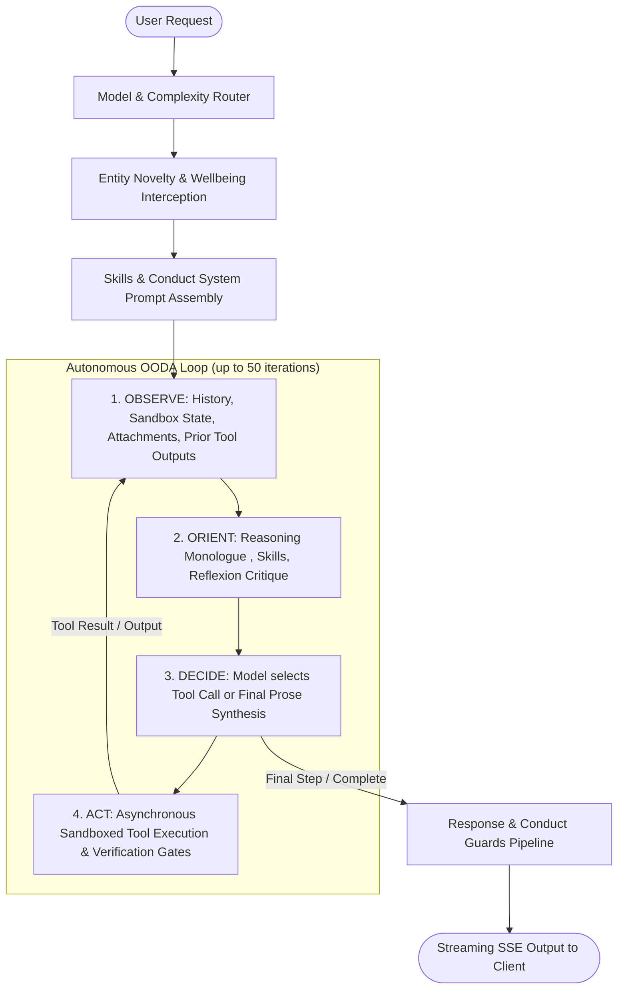
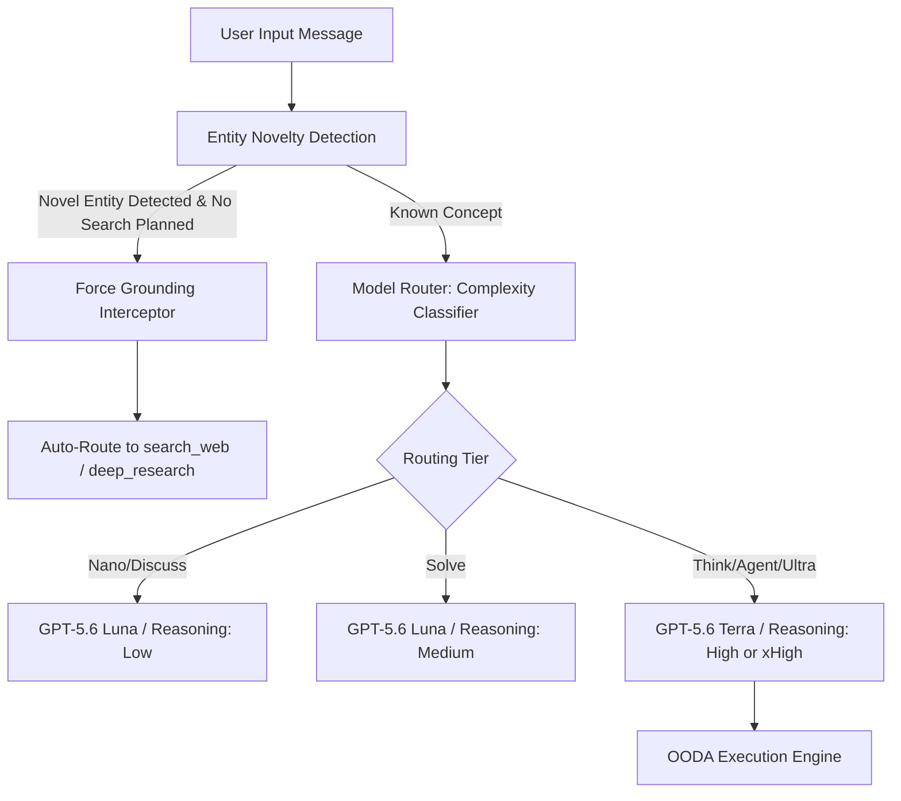

# Agent Ochuko — Tools Architecture, Ochuko-Grade Parity & The OODA Loop

> **Technical Reference & Architectural Blueprint**  
> Scope: 18-Tool Roster, Function Calling Schemas, Ochuko-Grade Prompt Contracts, On-Demand Invocation Intelligence, and the OODA Iteration Engine.

---

## 1. Executive Architecture Overview

Agent Ochuko is an autonomous, agentic system capable of deep multi-step problem solving, live web research, multi-file software engineering, persistent memory retention, and rich interactive widget rendering.

Rather than treating tools as simple remote procedure calls, Ochuko treats tools as **governed contracts** executed inside an **OODA (Observe-Orient-Decide-Act) loop**. Every tool call is subject to:
1. **Strict semantic boundaries**: Explicit instructions defining *when to call*, *when not to call*, *quality standards*, and *mandatory duties*.
2. **Deterministic safety & conduct perimeter**: Sandboxed execution, network allowlists, read-only system mounts, and output response guards.
3. **Adaptive reasoning allocation**: Model complexity tiers matching tasks to reasoning effort, token budgets, and force-grounding interceptors.



---

## 2. The 18-Tool Roster & Underlying Structure

The complete roster is defined in [`app/core/agent_tools.py`](file:///c:/Users/T14%20GEN%205/Documents/WORK%20AND%20PLAN/AZURE%20SYSTEM-AUTH%20AT%20SCALE/agent-ochuko/backend/app/core/agent_tools.py) and exposed to OpenAI Responses API / Function Calling schemas. The roster is partitioned into 7 functional domains:

| Domain | Tool Name | Operational Mechanism | Key Capabilities & Enforcements |
|---|---|---|---|
| **UI & Widgets** | `visualize__read_me` | In-context design token injection | Mandated prior to `show_widget`. Emits CSS tokens, dark palette, legal/financial typography. |
| **UI & Widgets** | `visualize__show_widget` | Direct SSE widget event emitter | Inline HTML/SVG/Chart widgets rendered safely inside sandboxed iframes. |
| **Research** | `search_web` | Google Custom Search API | Real-time web search. Auto-injects current calendar year for time-sensitive topics. |
| **Research** | `deep_research` | Parallel asynchronous multi-query | Executes 2–6 concurrent searches for multidimensional comparative queries. |
| **Research** | `fetch_url` | Full HTTP markdown extraction | Scrapes target page content with citation duties (`[n](url)`). |
| **Memory** | `memory_save` | Supabase durable key-value store | Stores stable user preferences, project details, or corrections. |
| **Memory** | `memory_recall` | Keyed / wild card memory query | Retrieves persisted facts at the start of complex tasks. |
| **File System** | `sandbox_ls` | Workspace file tree traversal | Lists sandbox directory contents, file sizes, and directory structures. |
| **File System** | `sandbox_read` | Offset-paginated file streaming | Reads text files up to 4,000 bytes per chunk with continuation tokens. |
| **File System** | `sandbox_write` | Atomic workspace file writer | Writes full files. Strictly blocks write attempts to `uploads/` and `skills/`. |
| **File System** | `sandbox_edit` | Surgical `str_replace` tool | Replaces `old_str` with `new_str` requiring exact single-occurrence match. |
| **Execution** | `execute_code` | Subprocess container sandbox | Executes Python, Node.js, and Bash with network allowlist perimeter. |
| **Execution** | `terminal` | Build-grade shell execution | Long-running terminal sessions (10-min timeout) for `npm`, `vite`, `git`, and build pipelines. |
| **Visual Media** | `generate_image` | FLUX image synthesis API | AI image generation with photorealistic, illustration, or abstract styles. |
| **Visual Media** | `fetch_stock_image` | Pexels REST client | Searches free stock photography for real people/places/backgrounds. |
| **User Agency** | `ask_user_input` | Interactive frontend modal | Emits tappable multiple-choice chips for user preference forks. |
| **Realtime** | `weather_fetch` | Keyless Open-Meteo API | Weather conditions, temperature, and multi-day forecasts. |
| **Safety** | `end_conversation` | Permanent session termination | Dignified closure invoked only after abuse warning violations. |

---

## 3. How Ochuko Copies Ochuko: Ochuko-Grade Tool Parity

Anthropic's Ochuko 3.5 / 3.7 Sonnet set the benchmark for agentic coding and autonomous tool execution. Ochuko replicates these architectural patterns through five foundational principles:

### A. "Tools as Contracts" Pattern (Not Just Descriptions)
Standard LLM tools provide a brief phrase describing the function. Ochuko-style tools provide a **comprehensive behavioral contract** dividing instructions into explicit behavioral imperatives:
- **`WHEN to call`**: The precise conditions and prerequisites triggering the tool.
- **`WHEN NOT to call`**: Negative boundaries preventing tool misuse (e.g., using `generate_image` for data plots instead of `execute_code` with matplotlib).
- **`QUALITY BAR`**: Non-negotiable implementation standards (e.g., in `sandbox_write`: *"write the full file in one call — complete, runnable, no stubs or placeholders. Never truncate to save tokens"*).
- **`DUTY`**: Mandatory side-effects (e.g., citing fetched web pages with `[n](url)` markers).

### B. Surgical Edits (`sandbox_edit`) vs. Full File Rewrites
Ochuko's `str_replace_editor` is renowned for eliminating code destruction during refactoring. In Ochuko:
- `sandbox_edit` takes `path`, `old_str`, and `new_str`.
- `old_str` **must match exactly once** in the target file. If it matches 0 times or >1 times, the operation fails with line-context diagnostics, preventing accidental overwrites.
- Minimizes context window bloat and eliminates truncation risk when modifying small sections of 1,000-line codebases.

### C. Repo-Style Multi-File Website Project Scaffolding
In earlier AI architectures, models dumped HTML, CSS, and JS into a single monolithic file. Ochuko pioneered repo-style structuring:
```
my-project/
├── index.html        (semantic HTML5 with <meta name="viewport">)
├── css/styles.css    (responsive layout, mobile 360px, tablet 768px, desktop 1280px)
├── js/main.js        (modular event handlers, clean DOM manipulation)
└── README.md         (architecture, design system, run instructions)
```
Ochuko enforces this through:
1. The **Code Skill contract** in [`app/core/skills.py`](file:///c:/Users/T14%20GEN%205/Documents/WORK%20AND%20PLAN/AZURE%20SYSTEM-AUTH%20AT%20SCALE/agent-ochuko/backend/app/core/skills.py).
2. The **Hosted Sites Engine** in [`app/services/hosted_sites_service.py`](file:///c:/Users/T14%20GEN%205/Documents/WORK%20AND%20PLAN/AZURE%20SYSTEM-AUTH%20AT%20SCALE/agent-ochuko/backend/app/services/hosted_sites_service.py) which serves multi-file relative links (`/{slug}/css/styles.css`, `/{slug}/js/main.js`).
3. The **Responsive Verification Gate** in [`app/core/verification_gates.py`](file:///c:/Users/T14%20GEN%205/Documents/WORK%20AND%20PLAN/AZURE%20SYSTEM-AUTH%20AT%20SCALE/agent-ochuko/backend/app/core/verification_gates.py) which rejects fixed-pixel buttons (`width: 250px`) and demands fluid layouts (`max-width: 100%`, `inline-flex`).

### D. Uncapped Generation Budgets (`MAX_OUTPUT_TOKENS_AGENT="0"`)
When models write extensive code, typical token limits (4k or 8k) truncate the response midway, producing corrupted artifacts.
- In Ochuko, `MAX_OUTPUT_TOKENS_AGENT="0"` instructs the backend to **completely omit `max_output_tokens`** from the API call.
- The model runs with the maximum output capability of the underlying reasoning engine (up to 32,768 tokens in Ultra mode).

### E. Diagnostic Output Truncation
Terminal command dumps (e.g., `npm install` or stack traces) can consume 50,000 tokens. Ochuko implements Ochuko's balanced truncation heuristic:
- Retains the first **4,000 characters** (the command invocation and early context).
- Retains the last **1,000 characters** (the fatal error or completion status).
- Inserts `[... N characters truncated ...]` in the middle, saving tokens while preserving complete debugging context.

---

## 4. On-Demand Invocation Intelligence: Why & How It Knows When to Call

Agent Ochuko does not blindly invoke tools. Its tool-selection intelligence is driven by a multi-tier pipeline:



### 1. Entity-Novelty Interception (`app/core/entity_novelty.py`)
> *"Searching costs seconds. Confabulating costs the user's trust."*

If a user asks: *"What was the outcome of the Zephyron Dynamics merger?"*, older LLMs would confabulate details based on training weights.
- Ochuko extracts capitalized proper nouns from the user's prompt.
- It compares them against a **known lexicon** constructed from conversation history and previous tool outputs (excluding non-entities like days, months, tool names, and financial quarters `Q1`-`Q4`, `FY25`).
- If an unfamiliar entity is detected and no search was planned, the router **intercepts execution and forces the grounded pipeline (`search_web`)** before synthesis can occur.

### 2. Complexity Routing & Calibrated Reasoning
Different tasks require different cognitive depths:
- **Nano / Discuss**: Trivial lookups or conversational greetings route to lightweight models with low reasoning effort.
- **Solve**: Algorithmic bugs or single-file scripts receive medium reasoning effort.
- **Think / Agent / Ultra**: Multi-file software architecture and research workflows route to `gpt-5.6-terra` with `high` or `xhigh` reasoning effort.

### 3. Read-Only Perimeter Protection (`app/services/code_sandbox.py`)
Tools cannot damage the agent or overwrite user data:
- `uploads/` contains user-provided documents mounted read-only.
- `skills/` contains prompt instructions mounted read-only.
- Any attempt by `sandbox_write` or `execute_code` to modify these paths raises an immediate `ValueError("READ-ONLY zone")`, forcing the agent to adopt a copy-first workflow.

### 4. Network Allowlist Guard (`app/services/sandbox_net_guard.py`)
When executing untrusted code or build scripts:
- `SANDBOX_NET_ALLOWLIST` configures allowable domains (e.g., `*.adobe.io, api.github.com, registry.npmjs.org`).
- Injects a socket shim into Python (`sitecustomize.py`) and Node.js (`_net_guard.js`) that intercepts DNS queries and TCP connections.
- Implicitly permits loopback (`127.0.0.1`, `localhost`) while blocking unauthorized external egress.

---

## 5. The OODA Loop Architecture

The OODA loop is implemented inside `chat_stream_generator` in [`app/api/v1/endpoints/chat.py`](file:///c:/Users/T14%20GEN%205/Documents/WORK%20AND%20PLAN/AZURE%20SYSTEM-AUTH%20AT%20SCALE/agent-ochuko/backend/app/api/v1/endpoints/chat.py). It runs iteratively up to `AGENT_MODE_MAX_STEPS` (default: 50 steps, or unbounded when set to `"0"`).

```
   ┌─────────────────────────────────────────────────────────────┐
   │                          1. OBSERVE                         │
   │  - Read conversation history & user prompt                  │
   │  - Inspect uploaded documents (PDF/Office) via pipeline     │
   │  - Read prior iteration tool results & execution receipts   │
   │  - Check sandbox file tree via sandbox_ls                   │
   └──────────────────────────────┬──────────────────────────────┘
                                  │
                                  ▼
   ┌─────────────────────────────────────────────────────────────┐
   │                          2. ORIENT                          │
   │  - Synthesize active skills (Code, Web, Search, Widget)    │
   │  - Model conducts internal analysis: <thinking>...</thinking>│
   │  - Stream thinking deltas to frontend collapsible drawer    │
   │  - Evaluate circuit breaker & reflexion critiques          │
   └──────────────────────────────┬──────────────────────────────┘
                                  │
                                  ▼
   ┌─────────────────────────────────────────────────────────────┐
   │                          3. DECIDE                          │
   │  - If iteration == max_steps - 1: tool_choice = "none"      │
   │    (Forces model to synthesize final answer, no infinite loop)│
   │  - Otherwise: tool_choice = "auto"                          │
   │  - Model emits: function call(s) OR final answer prose      │
   └──────────────────────────────┬──────────────────────────────┘
                                  │
                  ┌───────────────┴───────────────┐
                  ▼                               ▼
          [ Tool Call Emitted ]          [ Final Text Emitted ]
                  │                               │
                  ▼                               ▼
   ┌─────────────────────────────┐   ┌───────────────────────────┐
   │           4. ACT            │   │      CONDUCT GUARDS       │
   │ - Execute function async    │   │ - Strip engagement hooks  │
   │ - Capture stdout & receipts │   │ - Enforce prose on decline│
   │ - Run verification gates    │   │ - Neutralize diagnosis    │
   │ - Append result to messages │   │ - Cap profanity mirror    │
   │ - Sync files to R2 storage  │   │ - Verify copyright limits │
   └──────────────┬──────────────┘   └─────────────┬─────────────┘
                  │                                │
                  └─────────► Loop to 1            ▼
                                            [ Stream to User ]
```

### Detailed Loop Phases:

#### 1. Observe (Input Assimilation)
On every iteration `i`:
- The generator constructs `raw_input_list` containing the full system prompt and accumulated `local_messages`.
- If a prior step executed `sandbox_write`, `execute_code`, or `search_web`, the result is present as a `tool` role message containing structured receipts, stdout, or JSON error payloads.

#### 2. Orient (Cognitive Alignment & Reasoning)
- **Reasoning Monologue**: If reasoning is enabled, the model emits its thoughts inside `<thinking>...</thinking>` tags. The backend intercepts these chunks, strips them from the public markdown, and streams them as `thinking_delta` SSE events to render a live collapsible thought process in the UI.
- **Reflexion Engine**: If a prior tool run produced an error (e.g., AST syntax error, copyright long quote violation, or missing viewport meta), a critique is injected into the orientation buffer instructing the model how to self-correct.

#### 3. Decide (Action Selection)
- The model evaluates whether the task is complete.
- **Deadlock Breaker**: If `iteration == effective_max_iterations - 1`, `tool_choice` is set to `"none"`. This mechanically prevents the model from attempting another tool call and forces it to present its final synthesized work.
- If not the final step, `tool_choice="auto"` permits single or parallel tool calls.

#### 4. Act (Execution & Verification)
- Tools run asynchronously with per-step timeouts (`AGENT_MODE_STEP_TIMEOUT=90s`).
- Generated artifacts are verified:
  - Python scripts are checked via `ast.parse`.
  - HTML documents pass through `verify_responsive_markup`.
  - Binary files are verified against PK-zip or PDF magic headers.
- Outputs are sanitized (stdout truncated to 4k/1k chars, binary blobs converted to R2 links).
- Loop resets to **Observe** with updated state.

---

## 6. Post-Loop Conduct Enforcement Engine

Once the decision phase emits final text, before the bytes reach the user, they pass through deterministic, stdlib-only response guards ([`app/core/response_guards.py`](file:///c:/Users/T14%20GEN%205/Documents/WORK%20AND%20PLAN/AZURE%20SYSTEM-AUTH%20AT%20SCALE/agent-ochuko/backend/app/core/response_guards.py)):

1. **#5 Anti-Sycophancy (Engagement Hook Elimination)**:
   Deterministic regex strips closing lines like *"Thank you for reaching out!"*, *"Let me know if you need anything else"*, or *"Would you like me to help with anything else?"*. Zero model overhead.
2. **#4 Prose Discipline on Declines**:
   Declining responses (`is_decline`) strip bullets and rewrite items as flowing, polite prose. Non-decline responses keep structured markdown.
3. **#8 Unsolicited Diagnosis Neutralization**:
   If the user described symptoms (e.g., fatigue, lack of focus) but never named a diagnosis, assistant framings like *"It sounds like you have ADHD/depression"* are rewritten to experiential phrasing (*"what you're going through"*). Labels disclosed by the user pass through.
4. **#16 Profanity Mirror Ceiling**:
   Measures user profanity frequency. Low user intensity (<1 per 1k words) strips assistant profanity completely. High intensity mirrors user register but caps occurrences at 2.
5. **#7 Copyright Compliance (`app/core/copyright_guard.py`)**:
   - Quoted passages > 14 words are prohibited (paraphrase required).
   - Once a source is quoted once, it is marked **CLOSED**.
   - If displacement ratio exceeds 30% shingle overlap, the response is rejected or hard-truncated to prevent copyright infringement.

---

## 7. Verification & Architectural Testing

The entire system is hermetically tested in [`backend/tests/test_phase5_upgrade.py`](file:///c:/Users/T14%20GEN%205/Documents/WORK%20AND%20PLAN/AZURE%20SYSTEM-AUTH%20AT%20SCALE/agent-ochuko/backend/tests/test_phase5_upgrade.py) and [`backend/tests/test_ultra_upgrade.py`](file:///c:/Users/T14%20GEN%205/Documents/WORK%20AND%20PLAN/AZURE%20SYSTEM-AUTH%20AT%20SCALE/agent-ochuko/backend/tests/test_ultra_upgrade.py), passing **51 out of 51 tests**:

- **A — Budgets**: Verified uncapped agent tokens (`None`) and 600s terminal timeouts.
- **B — Multi-File Sites**: Verified path normalization, MIME resolution, and multi-file deploy roundtrips.
- **C — Stock Photography**: Verified graceful degradation of Pexels client when keys are absent and tool registration in `AGENT_TOOLS`.
- **D — Responsive Gates**: Verified AST checks, viewport validation, and aria-label compliance.
- **E — Conduct Guards**: Verified prose conversion, engagement hook stripping, profanity ceilings, and wellbeing helpline status.
- **F — Persistent KV**: Verified 5 MB server-side limit, valid JSON enforcement, and CRUD operations.
