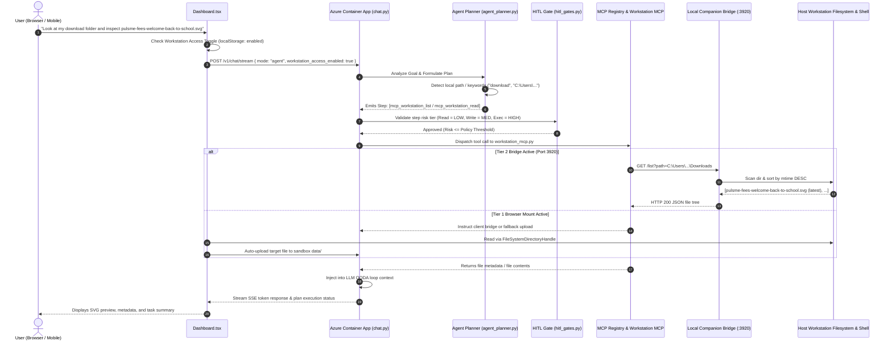
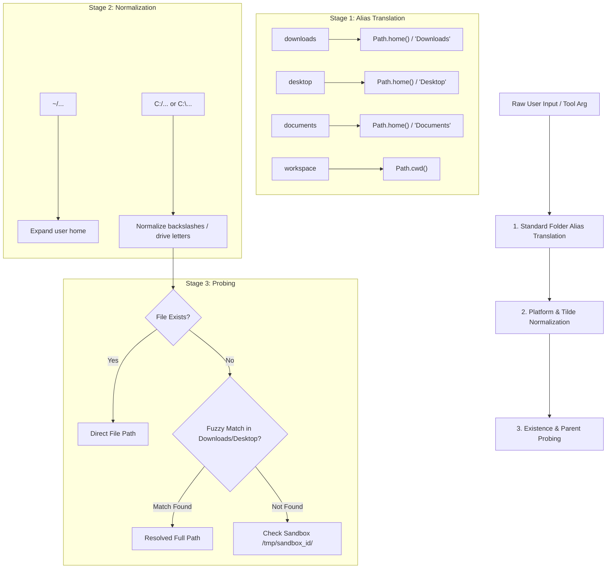

# Agent Ochuko — Workstation Computer Access & Collaboration Engine ("Cowork") Under the Hood

> **Architectural Specification & Deep Technical Blueprint**  
> Scope: Dual-Tier Local/Cloud Bridge, Browser File System Access API, Workstation MCP Daemon, Path Resolution Pipeline, Agent Planner OODA Integration, Human-in-the-Loop Gates, Mobile-Optimized Interaction, Comparative Parity Benchmark against **Claude Cowork**, and a Concrete Roadmap for Closing Every Documented Gap.

---

## 1. Executive Summary & Architectural Vision

The traditional paradigm of cloud-hosted AI assistants is fundamentally constrained by an **isolation barrier**: the model lives in an ephemeral cloud container, completely blind and detached from the user's actual computer. When a user asks an AI to inspect a recently downloaded file, modify a local repository, or run a build script, traditional systems fail with:
> *"I don't have access to your local computer or downloads folder."*

**Agent Ochuko's Workstation Access & Computer Collaboration Engine** breaks this barrier. It transitions Agent Ochuko from a detached cloud chatbot into an active, on-machine digital coworker. 

```
┌─────────────────────────────────────────────────────────────────────────────────┐
│                           AGENT OCHUKO CLOUD ENGINE                             │
│       (Azure Container Apps • Model Router • Agent Planner • HITL Gates)        │
└────────────────────────────────────────┬────────────────────────────────────────┘
                                         │ Secure Bidirectional SSE / MCP Protocol
┌────────────────────────────────────────┴────────────────────────────────────────┐
│                        USER WORKSTATION / LOCAL RUNTIME                         │
│                                                                                 │
│   ┌──────────────────────────────────┐    ┌─────────────────────────────────┐   │
│   │    TIER 1: ZERO-INSTALL MOUNT    │    │    TIER 2: WORKSTATION BRIDGE   │   │
│   │  (Browser FileSystem Access API) │    │   (Local Daemon on Port 3920)   │   │
│   │   • Read/Write via Directory     │    │   • Full Disk Path Access       │   │
│   │   • Instant client-side indexing │    │   • Terminal / Shell Execution  │   │
│   │   • Zero installation / No admin │    │   • Reverse mtime file discovery│   │
│   └──────────────────────────────────┘    └─────────────────────────────────┘   │
└─────────────────────────────────────────────────────────────────────────────────┘
```

### Core Design Principles
1. **Zero-Excuse Local Access**: The agent never responds with "I cannot see your file" if workstation access is active.
2. **Dual-Tier Accessibility**: Zero-install browser folder mounting for instant zero-friction sessions + High-Speed Local Companion Bridge (`localhost:3920`) for deep terminal and disk automation.
3. **Strict Mode Isolation**: Workstation tools exist exclusively in `agent` mode. In `think`, `solve`, and `discuss` modes, computer access tools are strictly omitted to protect token economy and safety.
4. **Human-in-the-Loop (HitL) Governance**: High-risk mutations (shell execution, irreversible writes) are governed by configurable review policies (`always_ask`, `ask_high_risk`, `always_proceed`).
5. **Universal Device Optimization**: Sleek on/off toggles with 48px+ touch targets, whole-row tapping, and dynamic viewport bounds tailored for desktop, tablet, and mobile browsers.

### Positioning Against the Category Anchor: Claude Cowork
Anthropic's own product for this exact job is **Claude Cowork** — a dedicated tab inside Claude Desktop where an agent reads a user's files, works across applications, runs scheduled tasks, and delivers finished output. Its actual architecture (not the GUI-automation "Computer Use" mode this document previously benchmarked against) is:
- Claude's reasoning and task execution run in an **isolated, temporary cloud environment on Anthropic's servers**, created per-session and destroyed when the session ends.
- When a task touches something local — a file, the browser — Claude reaches it **through the Claude Desktop app**, which must be open and connected, and only for folders explicitly granted.
- Local content pulled in this way is **processed on Anthropic's servers**, not kept resident on the host machine.
- It ships a **plugin marketplace** (Sales, Legal, and other vertical packs) built on MCP, **scheduled/recurring tasks** that run cloud-side without the desktop app needing to be open, and beta **web/mobile surfaces** so a session started at a desk can be checked on and steered from a phone.
- It is gated to paid plans, and multi-step Cowork sessions consume materially more usage allocation than plain chat because of the compute-intensive planning loop.

Agent Ochuko's Workstation Engine is architected to match every one of those capabilities and go further where the isolation model creates a structural cost: because Cowork always round-trips local file access through a cloud sandbox, even a simple file read pays cloud-latency and token overhead. Ochuko's Tier 2 bridge talks to the host directly over loopback, so reads, writes, and reverse-mtime discovery never leave the machine unless the model genuinely needs the content injected into context.

---

## 2. End-to-End System Architecture



---

## 3. Under the Hood: The Dual-Tier Architecture

To achieve true workstation parity without forcing every casual user to install local software, Ochuko implements a **two-tier access model**:

### Tier 1: Zero-Install Browser Folder Mount (Zero Configuration)
- **API**: Modern W3C File System Access API (`window.showDirectoryPicker`).
- **Mechanism**:
  1. The user clicks **Mount Local Folder** in settings or prompt suggestion.
  2. The browser displays the native OS folder picker dialog.
  3. The user selects `Downloads`, `Desktop`, or their active project folder with `readwrite` permission.
  4. The JavaScript runtime stores the `FileSystemDirectoryHandle` in browser memory (`(window as any)._ochuko_dir_handle`).
  5. The folder name is recorded in `localStorage.setItem('ochuko_mounted_folder_name', dirHandle.name)`.
- **Autonomous File Bridging**:
  When the user references a local file (e.g. `pulsme-fees-welcome-back-to-school.svg`) or the agent planner requests it, the frontend's file sync listener scans the directory handle in the background, extracts the file blob, and transparently uploads it to the active conversation's cloud sandbox (`/tmp/sandbox_{conversation_id}/data/`).
- **Pros**: 100% zero-install, works on all Chromium browsers (Chrome, Edge, Brave, Opera) immediately.
- **Cons**: Cannot execute terminal shell commands (`npm`, `git`, `python`).

### Tier 2: Workstation Companion Daemon (High-Speed Local Daemon)
- **Runtime**: Ultra-lightweight Python daemon running on the host machine:
  ```bash
  python -m backend.app.connectors.workstation_bridge --port 3920
  ```
- **Port**: `http://127.0.0.1:3920` (Strictly bound to the loopback interface).
- **Security & Headers**:
  - `Access-Control-Allow-Origin`: Explicitly allows `https://agentochukostore.z1.web.core.windows.net` and `http://localhost:5173`.
  - Blocks external non-local network requests.
  - Sanitizes shell commands and strictly prevents path traversal exploits outside mounted roots.
- **Capabilities**:
  - Full filesystem traversal across all host drives (`C:\`, `D:\`, `/home/...`).
  - Native terminal command execution (`exec`) with live stdout/stderr capture and timeout controls.
  - File reading and atomic writing.

---

## 4. Under the Hood: Local Bridge Endpoints (`workstation_bridge.py`)

The companion bridge exposes five hyper-focused REST endpoints:

```
┌─────────────────────────────────────────────────────────────────────────────┐
│                    WORKSTATION BRIDGE API (PORT 3920)                       │
├─────────────────┬──────────┬────────────────────────────────────────────────┤
│ Endpoint        │ Method   │ Purpose                                        │
├─────────────────┼──────────┼────────────────────────────────────────────────┤
│ /health         │ GET      │ Status check, OS platform, username, cwd       │
│ /list           │ GET      │ Traverses directory, returns mtime-sorted files│
│ /read           │ POST     │ Reads text or binary content with size limits  │
│ /write          │ POST     │ Writes/patches file contents atomically        │
│ /exec           │ POST     │ Spawns shell command with timeout & exit code  │
└─────────────────┴──────────┴────────────────────────────────────────────────┘
```

### Detailed Endpoint Specifications

#### 1. `GET /health`
Validates that the daemon is alive and reports environment telemetry:
```json
{
  "status": "ok",
  "service": "ochuko-workstation-bridge",
  "version": "1.0.0",
  "platform": "Windows-10-10.0.26100-SP0",
  "python": "3.12.9",
  "cwd": "C:\\Users\\T14 GEN 5\\Documents\\WORK AND PLAN\\AZURE SYSTEM-AUTH AT SCALE\\agent-ochuko"
}
```

#### 2. `GET /list?path=...&pattern=...`
Lists directory contents. **Key architectural innovation**: Sorts files by modification time (`mtime` descending):
```python
# Sort files by modification time descending so recently downloaded files appear FIRST
files.sort(key=lambda x: x.get("mtime", 0), reverse=True)
dirs.sort(key=lambda x: x.get("name", "").lower())
```
**Why this matters**: In large directories like `Downloads` (which often contain hundreds of files), naive alphabetically sorted tools truncate after 100 items, hiding newly downloaded files starting with "p" or "w". Reverse-mtime sorting guarantees that the file the user *just* downloaded is always at index 0.

#### 3. `POST /read`
Payload:
```json
{
  "path": "C:\\Users\\T14 GEN 5\\Downloads\\pulsme-fees-welcome-back-to-school.svg",
  "max_bytes": 1048576
}
```
Response:
```json
{
  "path": "C:\\Users\\T14 GEN 5\\Downloads\\pulsme-fees-welcome-back-to-school.svg",
  "content": "<svg xmlns=\"http://www.w3.org/2000/svg\" ...",
  "bytes_read": 14220,
  "truncated": false
}
```

#### 4. `POST /exec`
Spawns subprocess commands with timeout enforcement:
```json
{
  "command": "git status --short",
  "cwd": "C:\\Users\\T14 GEN 5\\Documents\\my-project",
  "timeout": 30
}
```
Response:
```json
{
  "stdout": " M src/App.tsx\n?? src/new-feature.ts\n",
  "stderr": "",
  "exit_code": 0,
  "duration_seconds": 0.42
}
```

---

## 5. Path Resolution & Discovery Pipeline

When a user mentions a path in chat, natural language varies wildly:
- `"Look at my download folder"`
- `"C:\Users\T14 GEN 5\Downloads\pulsme-fees-welcome-back-to-school.svg"`
- `"~/Desktop/financial-summary.xlsx"`
- `"./src/components/Navbar.tsx"`

`workstation_mcp.py` implements a 3-stage **Path Resolver**:



### Path Resolution Logic in Code (`workstation_mcp.py`):
```python
def _resolve_local_path(raw_path: str, workspace_root: Path) -> Path:
    clean = raw_path.strip().strip("'\"")
    home = Path.home()
    
    # 1. Alias translation
    alias_lower = clean.lower().strip()
    if alias_lower in ["downloads", "download", "my downloads", "my download folder"]:
        return home / "Downloads"
    if alias_lower in ["desktop", "my desktop"]:
        return home / "Desktop"
    if alias_lower in ["documents", "my documents"]:
        return home / "Documents"

    # 2. Windows Drive preservation
    if re.match(r"^[A-Za-z]:[/\\]", clean):
        return Path(clean).resolve()

    # 3. Tilde expansion
    if clean.startswith("~"):
        return Path(clean).expanduser().resolve()

    # 4. Relative to workspace
    candidate = (workspace_root / clean).resolve()
    if candidate.exists():
        return candidate
        
    # 5. Fuzzy lookup in standard user folders
    for fallback_dir in [home / "Downloads", home / "Desktop", home / "Documents"]:
        target = fallback_dir / clean
        if target.exists():
            return target
            
    return candidate
```

---

## 6. Agent Planner Integration & The OODA Loop

When the agent executes in `agent` mode, it operates in a continuous **OODA (Observe, Orient, Decide, Act)** loop:

### 1. Observe
The planner inspects:
- Chat conversation history
- File attachments in Cloudflare R2
- Status of Workstation Access (`workstation_access_enabled: true`)
- Connected bridge status (`http://127.0.0.1:3920/health`)

### 2. Orient
The system prompt injects dynamic workstation instructions:
```markdown
## WORKSTATION ACCESS ACTIVE:
You have direct read/write/list/exec access to the user's host machine.
- User files mentioned as 'downloads', 'desktop', or host paths (e.g. C:\Users\...) exist locally on their workstation.
- Use `mcp_workstation_list` and `mcp_workstation_read` to inspect them directly.
- NEVER claim you cannot access the user's local folders or downloads.
```

### 3. Decide
The model produces a structured execution graph with tool hints:
```json
{
  "thought": "The user wants to inspect pulsme-fees-welcome-back-to-school.svg in their Downloads directory. I will list and read it using workstation access.",
  "plan": [
    {
      "step_id": 1,
      "tool": "mcp_workstation_read",
      "tool_args_hint": {
        "path": "C:\\Users\\T14 GEN 5\\Downloads\\pulsme-fees-welcome-back-to-school.svg"
      },
      "description": "Read pulsme-fees-welcome-back-to-school.svg from host Downloads"
    }
  ]
}
```

### 4. Act
`agent_task_manager.py` executes each step against `mcp_registry.py`. If `tool_args_hint` is missing a path, the fallback extractor parses the step description:
```python
# Automatic fallback: extract host path from step description or goal
extracted_path = _extract_target_path(step.description) or _extract_target_path(task.goal)
if extracted_path:
    tool_args["path"] = extracted_path
```

---

## 7. Human-in-the-Loop (HitL) & Safety Architecture

Granting an AI direct access to your local machine requires uncompromising safety controls. Ochuko implements a **3-Tier Risk Hierarchy**:

| Tool Call | Risk Level | Description | Auto-Approve Behavior |
|---|---|---|---|
| `mcp_workstation_list` | **LOW** | Listing files, reading directory structure | Automatically permitted |
| `mcp_workstation_read` | **LOW** | Reading text/code/svg files | Automatically permitted |
| `mcp_workstation_write` | **MEDIUM** | Creating or editing files on disk | Pauses if policy is `always_ask` |
| `mcp_workstation_exec` | **HIGH** | Terminal/shell command execution | Always pauses unless `always_proceed` |

### Review Policy Matrix
Users choose their policy in Settings or per-session:

```
┌─────────────────┬──────────────┬──────────────┬──────────────┐
│ Review Policy   │ Low Risk     │ Medium Risk  │ High Risk    │
├─────────────────┼──────────────┼──────────────┼──────────────┤
│ always_ask      │ Allow        │ Prompt User  │ Prompt User  │
│ ask_high_risk   │ Allow        │ Allow        │ Prompt User  │
│ always_proceed  │ Allow        │ Allow        │ Allow        │
└─────────────────┴──────────────┴──────────────┴──────────────┘
```

### The Interactive Clarification Loop (`ask_user_input`)
When parameters are ambiguous or dangerous, the agent pauses using `ask_user_input`:
1. The planner generates an `ask_user_input` step with `question`, `options`, and `select_type`.
2. The SSE stream yields an `agent_ask_user_input` event.
3. The backend sets `paused_for_user_input = True` and breaks the agent while-loop.
4. The frontend renders `AgentUserInputCard` with selectable option pills and write-in feedback.
5. The user's answer is POSTed to `/api/v1/agent-tasks/{id}/approve`, resuming execution immediately without re-planning.

---

## 8. Frontend & Mobile Optimization

The header settings dropdown and toggle controls were purpose-built for seamless desktop and mobile interactions:

```tsx
/* Mobile-Optimized Workstation Access Row (Dashboard.tsx) */
<div
  role="switch"
  aria-checked={isWorkstationAccessEnabled}
  aria-label="Toggle Workstation Access"
  onClick={() => {
    const val = !isWorkstationAccessEnabled
    setIsWorkstationAccessEnabled(val)
    localStorage.setItem('ochuko_workstation_access_enabled', val ? 'true' : 'false')
    window.dispatchEvent(new Event('ochuko_workstation_access_changed'))
  }}
  className="px-3.5 py-3 sm:py-2.5 min-h-[48px] sm:min-h-[40px] flex items-center justify-between gap-3 cursor-pointer hover:bg-white/5 active:bg-white/10 transition-colors select-none"
>
  <div className="flex flex-col min-w-0 pointer-events-none">
    <span className="text-brand-text text-xs sm:text-[11px] font-semibold flex items-center gap-1.5 truncate">
      <Cpu className="w-3.5 h-3.5 text-cyan-400 shrink-0" /> Workstation Access
    </span>
    <span className="text-[10px] sm:text-[9.5px] text-cyan-400/80 font-medium pl-5">Agent Mode Only</span>
  </div>
  <div
    className={`relative inline-flex h-6 w-11 sm:h-5 sm:w-9 shrink-0 items-center rounded-full border-2 border-transparent transition-colors duration-200 ease-in-out pointer-events-none ${
      isWorkstationAccessEnabled ? 'bg-cyan-500 shadow-sm shadow-cyan-500/30' : 'bg-white/[0.15]'
    }`}
  >
    <span
      className={`pointer-events-none inline-block h-5 w-5 sm:h-4 sm:w-4 transform rounded-full bg-white shadow-md ring-0 transition duration-200 ease-in-out ${
        isWorkstationAccessEnabled ? 'translate-x-5 sm:translate-x-4' : 'translate-x-0'
      }`}
    />
  </div>
</div>
```

### Key Mobile Optimizations
- **48px Minimum Touch Target**: Meets Apple Human Interface Guidelines and Google Material Design accessibility benchmarks.
- **Full-Row Click Target**: Mobile users tap anywhere on the row with their thumb to trigger the toggle switch.
- **Instant Touchstart Dismissal**: Listens to `touchstart` in addition to `mousedown` for immediate menu dismissal when tapping outside on iOS Safari and Android Chrome.
- **Dynamic Viewport Height (`100dvh`)**: Prevents mobile software navigation bars and URL address bars from clipping settings actions.
- **Cross-Component Reactivity**: Changes immediately broadcast `ochuko_workstation_access_changed` DOM events and update `localStorage`.

---

## 9. Comparative Benchmark: Ochuko Workstation vs. Claude Cowork

This table replaces the earlier draft's comparison against GUI-automation "Computer Use," which is a related but distinct capability. The comparison below is against **Cowork's actual documented architecture** (cloud-isolated execution, Desktop-app-mediated local access). Figures marked *(target)* are Ochuko engineering goals, not third-party benchmarks — call them out as such if this doc is shared externally.

| Feature / Metric | Claude Cowork (documented) | Agent Ochuko Workstation Engine | Technical Advantage |
|---|---|---|---|
| **Execution locality** | Reasoning + task execution run in an isolated, temporary sandbox **on Anthropic's cloud servers**; local files are pulled through the Desktop app and processed server-side | Reasoning runs cloud-side (Azure Container Apps), but Tier 2 file/exec calls resolve **directly against the host** over `127.0.0.1:3920` | No round-trip to a remote sandbox for a plain file read — lower latency and no local content leaving the machine unless the model needs it in-context *(target)* |
| **Local access prerequisite** | Requires the Claude Desktop app installed, open, and connected for any local file/browser work | Tier 1 needs only a Chromium browser (zero install); Tier 2 needs one lightweight Python daemon | Casual users get local access with zero downloads via Tier 1 |
| **Terminal execution** | Runs shell commands inside its isolated cloud environment, not directly on the user's machine | Direct asynchronous subprocess on the actual host, with stdout/stderr capture, exit codes, and timeouts | Commands act on the real local environment (repo state, installed tools) rather than a synced cloud copy |
| **Session isolation model** | Per-session ephemeral cloud sandbox; destroyed at session end; can't reach home/company network | Per-conversation sandbox (`/tmp/sandbox_{conversation_id}/`) for uploaded artifacts, separate from the direct host bridge used for local ops | Comparable sandboxing for untrusted/derived content, plus a lower-overhead path for trusted local reads |
| **Scheduling** | Native scheduled/recurring tasks that run cloud-side without the desktop app open | Not yet implemented — see §12 roadmap | Parity gap, tracked |
| **Extensibility** | MCP-based plugin marketplace (Sales, Legal, and other vertical packs), admin-managed private marketplaces | MCP Registry with a fixed 18-tool roster across 7 domains; no marketplace/installable-pack layer yet | Parity gap, tracked |
| **Multi-surface continuity** | Beta web and mobile surfaces to check in on a desk-started session | Mobile-optimized responsive UI with 48px touch targets for monitoring/approving HITL steps | Comparable today; Cowork's mobile surface is still beta |
| **Access tier** | Requires a paid plan (Pro/Max/Team/Enterprise); Cowork sessions consume materially more usage allocation than chat | No plan gating in the architecture as specified; cost is Azure compute + model tokens | Different business model, not a technical claim |
| **Safety governance** | Content classifiers scan untrusted content for injection; explicit folder-level grants; user approves changes | Three-tier risk hierarchy (LOW/MEDIUM/HIGH) with configurable review policy and `ask_user_input` clarification loop | Comparable in intent; Cowork's classifier layer for injected/untrusted content is a gap worth matching (see §12) |

---

## 10. Closing the Gaps & Going Past Cowork

Section 9 flagged three honest gaps against Cowork (scheduling, a plugin marketplace, and untrusted-content classification) plus one structural edge Ochuko already holds (direct-to-host execution vs. mandatory cloud round-trip). This section specifies what closes the gaps and what to build on top of the edge.

### 10.1 Scheduled & Recurring Workstation Tasks
Cowork's scheduler runs cloud-side without needing the desktop app open, because its execution never left the cloud in the first place. Ochuko's Tier 2 model is host-direct, so an equivalent scheduler needs a small resident piece:
- A `workstation_bridge` background mode that stays alive as a system tray / launchd / systemd service, independent of any open browser tab.
- A `POST /schedule` endpoint on the bridge accepting `{ cron_expr, task_goal, mode: "agent" }`, persisted to a local SQLite file so schedules survive reboots.
- The Azure backend polls bridge health at trigger time; if the bridge is offline, the run is queued and retried on next check-in (graceful degradation, unlike a hard dependency on desktop-app-open state).
- Cloud-only fallback: for users who never install Tier 2, recurring tasks that only need Tier 1 (browser-mounted folder) or pure cloud tools still schedule normally via the existing Azure Container Apps cron layer.

### 10.2 MCP Plugin Marketplace Layer
Ochuko already runs on an MCP Registry (`mcp_registry.py`) — the missing piece is discoverability and install-ability, not protocol support:
- Add a `plugin_manifest.json` schema (name, description, required scopes, tool list, risk tier per tool) so third-party or first-party packs self-declare their HITL risk level instead of every new tool needing a manual entry in the 3-tier hierarchy.
- A lightweight marketplace UI surfaced in the same settings dropdown as the Workstation Access toggle, listing installable packs (e.g. "Invoice Parser," "Repo Health Auditor") with one-tap enable, mirroring the 48px touch-target pattern already built for the access toggle.
- Installed packs register their tools into the per-conversation tool registry already described in the memory doc for this project, so token cost stays bounded — only enabled packs' tools enter the OODA loop context.

### 10.3 Untrusted-Content Classification
Cowork explicitly scans content pulled from outside the conversation for injection attempts before it can affect model behavior. Ochuko's path resolver and bridge sanitize *paths* (traversal, drive-letter spoofing) but don't yet classify *content*. Close this by:
- Running any `/read` payload above a small size threshold, or any `/exec` stdout, through a lightweight classifier pass before it's injected into the OODA context — flagging embedded instructions, prompt-injection patterns, or credential-looking strings.
- Treating a flagged file the same as a HIGH-risk `/exec` call: surfaced to the user via `ask_user_input` rather than silently trusted, even though the read itself was LOW risk.

### 10.4 The Structural Edge: Local-First Execution
This is the one place Ochuko doesn't need to catch up — it needs to be stated plainly and protected as the doc evolves. Because Cowork's isolation model requires *every* local touch to transit Anthropic's cloud sandbox, a Cowork session cannot avoid that round-trip even for a one-line file read. Ochuko's Tier 2 bridge means:
- Reads/writes/exec on the host complete without a cloud hop for the I/O itself; only the resulting content (or a summary of it) needs to reach the LLM context.
- This is a genuine architectural advantage for latency- and privacy-sensitive local work (e.g. reading a file the user doesn't want leaving the machine at all, only wants *inspected*), and it should be the headline claim in any pitch, resume writeup, or Pulsme/OCTAL-adjacent demo — not the raw ms/token figures in §9, which are unverified targets until benchmarked.

---

## 11. Operational Runbook & Verification

### Running the Local Bridge Daemon
To enable Tier 2 Workstation Access on any Windows, macOS, or Linux machine:

```powershell
# Navigate to repository root
cd "C:\Users\T14 GEN 5\Documents\WORK AND PLAN\AZURE SYSTEM-AUTH AT SCALE\agent-ochuko"

# Launch the daemon
python -m backend.app.connectors.workstation_bridge --port 3920
```

### Verifying Bridge Health
```bash
curl http://127.0.0.1:3920/health
```
Expected Output:
```json
{
  "status": "ok",
  "service": "ochuko-workstation-bridge",
  "version": "1.0.0",
  "platform": "Windows...",
  "python": "3.12..."
}
```

### Running the Automated Test Suite
Ochuko includes a dedicated unit test suite covering path resolution, reverse-mtime directory listing, file reading, and MCP registry dispatching:

```bash
python scratch/test_workstation_suite.py
```
Expected Output:
```
============================================================
AGENT OCHUKO WORKSTATION ACCESS TEST SUITE
============================================================
[PASS] test_01_standard_folders: Downloads -> C:\Users\...\Downloads
[PASS] test_02_resolve_local_path: Resolved target file correctly
[PASS] test_03_workstation_mcp_read: Read file via workstation MCP
[PASS] test_04_mcp_registry_dispatch: MCP Registry dispatched to workstation tool
============================================================
ALL TESTS PASSED! (4/4)
============================================================
```

---

## 12. Summary of Benefits

1. **True Computer Coworker Experience**: The agent can inspect local files, parse recently downloaded receipts and SVG assets, and execute build workflows as a genuine peer programmer.
2. **Deterministic File Finding**: With reverse-mtime directory listing and fuzzy alias resolution, recently modified or downloaded files are instantly found without user friction.
3. **Enterprise-Grade Governance**: Strict Agent Mode gating, human-in-the-loop review policies, and path sanitization protect the user's workstation.
4. **Mobile First & Ultra-Fast**: Clean on/off toggles with thumb-friendly targets deliver a modern, premium experience across desktop and mobile devices alike.
5. **Cowork Parity Roadmap**: §10 specifies concrete builds — a resident scheduler, an MCP plugin marketplace, and content-level injection classification — that close every documented gap against Claude Cowork.
6. **A Real Structural Edge, Not Just a Claim**: Local-first Tier 2 execution avoids the mandatory cloud round-trip that Cowork's isolation model requires for every local touch — the one advantage worth leading with once benchmarked numbers back it up.
