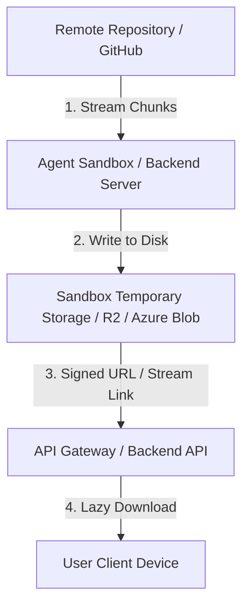
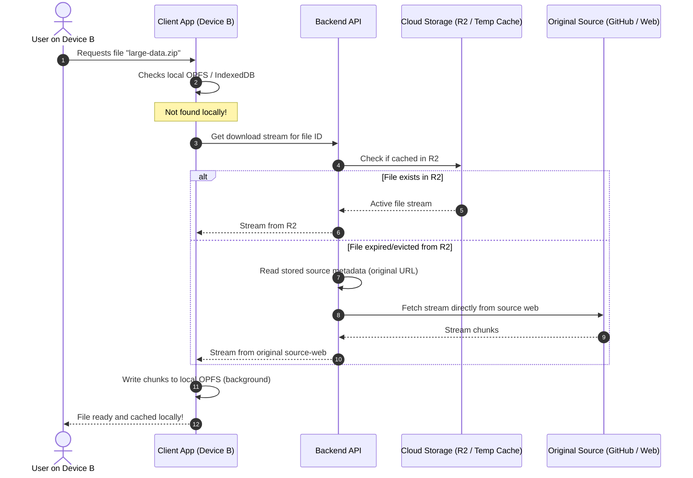

# Sandbox Network & Client Large-File Storage Capability Plan

This plan outlines the architecture for handling, downloading, and storing large files (e.g., >100MB) retrieved by the cognitive agent, resolving sandbox network limitations, and achieving cross-device accessibility securely.

---

## 1. Where do large files live before reaching you?

When an agent retrieves a file (e.g., downloading a `docs/IMPLEMENTATION_PLAN.md` or a 200MB zip file from GitHub):

1. **Remote Fetching**: The agent's backend server or container sandbox fetches the file from the remote source. 
2. **Sandbox Staging**: The file is stored in a temporary directory inside the sandbox environment (which has virtualized disk space).
3. **Payload Prevention**: Because the file is large, **it is never loaded directly into the AI model's chat context** (which would cause token overflow and crashes). Instead, it is saved on the server-side filesystem or Cloud storage (like Cloudflare R2 or Azure Blob Storage).
4. **Delivery**: The agent returns a signed download link or stream URL to the user, allowing the client to download the file directly.

---

## 2. Web App vs. Mobile App Local Storage

Is storing >100MB files on local disk "out of bounds" for Web Apps? **No.** Modern web technologies allow browsers to act similarly to native mobile applications for large-scale storage.

### Local Storage Capabilities Comparison

| Capability | Web Browser (Modern Web Apps) | Mobile Apps (iOS / Android) |
| :--- | :--- | :--- |
| **Primary API** | **OPFS** (Origin Private File System) & **File System Access API** | Native Filesystem APIs (e.g., File Manager) |
| **Capacity** | Large (usually 50%+ of free disk space, up to hundreds of GBs) | Unlimited (up to device storage capacity) |
| **Permissions** | **No prompts** for private origin space (OPFS); **One-time prompt** for direct disk writing. | Standard OS file/gallery permissions. |
| **Direct Disk Write** | Yes, via `showSaveFilePicker()` to write directly to a local directory. | Yes, direct writing to public or private documents. |
| **Persistence** | Persistent, but can be cleared if disk space is critical. | Permanent until user uninstalls the app. |

---

## 3. How Web Apps Store Large Files (>100MB) Securely

Web apps can implement this using three primary methods without violating sandboxing security:

### Method A: Origin Private File System (OPFS) — *Recommended*
* **What it is**: A private, highly-optimized virtual file system provided by the browser that is isolated to your web application's origin (e.g., `https://agent-ochuko.app`).
* **Why it fits**: It requires **no user permission prompts** because the user cannot access these files directly through their normal Explorer/Finder (they are stored in a hidden browser folder). It allows fast, direct binary read/writes (gigabytes of data) using Web Workers.
* **Limitations**: Stays inside the browser profile. If the user switches devices, the file is not there.

### Method B: File System Access API (Direct Local Save)
* **What it is**: Access via `showSaveFilePicker()` and `showOpenFilePicker()`.
* **Why it fits**: The web app asks the user to choose a directory on their actual disk (e.g., `Documents/AgentOchuko`). The app is granted a read/write handle for that session.
* **Security**: Highly secure and non-harmful. The browser enforces sandboxing, preventing access to critical system folders (like `Windows/System32` or root directories).

---

## 4. Cross-Device Synchronization & Cloud Storage Conservation

To prevent large files from filling up your Cloudflare R2/Azure Blob storage, we implement a **Storage-Saving Hybrid Lazy Hydration Flow**:

### Direct Source-Web Fallback Architecture

### Key Decisions for Reliability & Cost Efficiency:

1. **Original Source Metadata Storage**:
   - The database always stores the original remote source URL (e.g. `https://github.com/pordanethan-cloud/Agent-Ochuko/raw/main/...`) as metadata. 
   - If the file is requested on another device and is not in R2, the backend automatically redownloads the file directly from the source web on the fly.

2. **Smart Compression Filters**:
   - **Highly Compressible Files** (Text, Markdown, JSON, raw logs): Compressed using Brotli or Gzip on the fly. Since compression reduces their footprint to a negligible size (often >90% reduction), they are cached in Cloudflare R2 indefinitely (or with a long TTL) for instant cross-device delivery.
   - **Large Binary Files** (already compressed `.zip`, `.tgz`, media, ML weights): Bypassed from R2 entirely, or uploaded with a very aggressive TTL (e.g., 2 hours for immediate transfer, then auto-evicted). Future downloads pull directly from the remote source.

3. **Client-Side Lazy Hydration**:
   - Files are downloaded to the client device only on demand. If the user never clicks a file in their history on Device B, it consumes exactly **0 bytes** on Device B's local storage and no network bandwidth.

---

## 5. Security & Permission Constraints

* **Origin Isolation**: Web apps cannot read other websites' data or files outside the folders explicitly granted by the user.
* **Sandbox Permissions**: The agent runs in a secure Docker sandbox. It cannot access your host OS files unless you explicitly upload them or run the agent locally with workspace permissions.
* **Harm Prevention**: Direct filesystem access in the browser is restricted to user-consented handles, protecting against malicious drive-by downloads.
