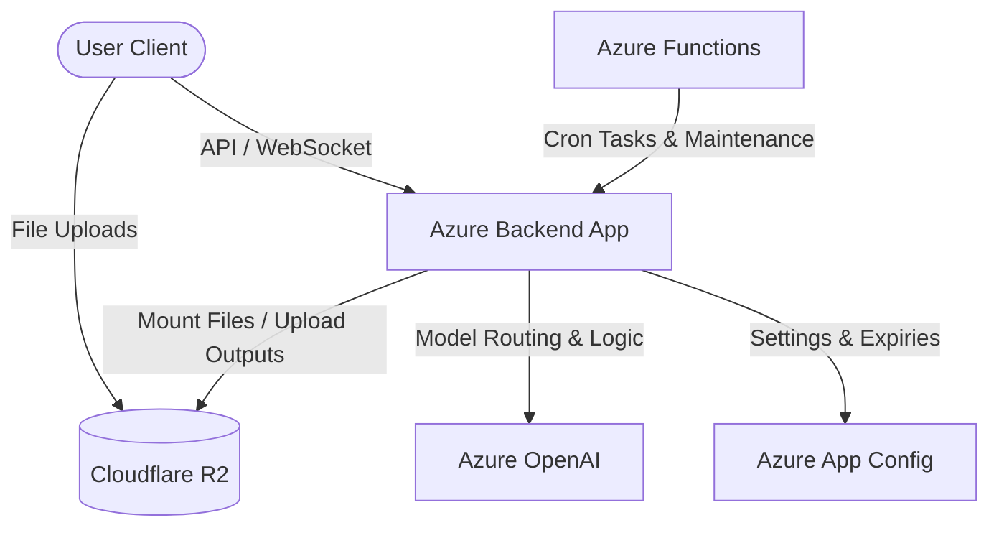
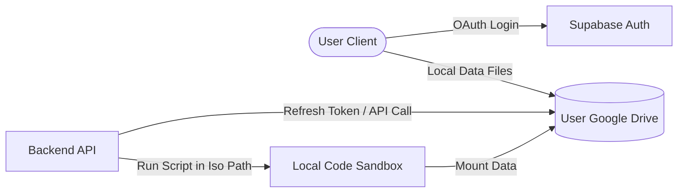

# Cost Reduction & Storage Architecture Study

This study analyzes the current infrastructure (Cloudflare & Azure) and proposes an architectural shift to utilize the user's personal Google Drive for file storage, reducing hosting costs to near zero while retaining a premium **Claude-like** user experience and robust **sandbox reliability**.

---

## 1. Current Infrastructure Breakdown & Cost Profile

Currently, Ochuko uses a hybrid cloud model split between **Cloudflare** and **Azure**:



### Current Usage:
* **Cloudflare R2:**
  * **Role:** Stores user-uploaded documents (under `uploads/`) and sandbox outputs (under `generated/`).
  * **Cost Drivers:** Storage space ($0.015/GB/month beyond 10GB) and Class A operations (uploads, deletes).
* **Azure OpenAI:**
  * **Role:** Powers model intelligence (e.g. `gpt-4o-mini`, `gpt-4o`).
  * **Cost Drivers:** Token consumption (input/output volume).
* **Azure App Configuration & Functions:**
  * **Role:** Configuration management and 6 background CRON tasks (quota resets, summaries, expirations).
  * **Cost Drivers:** Standard/Serverless execution triggers.

---

## 2. Proposed Architecture: Shifting Storage to Google Drive

To reduce centralized storage costs to **$0**, we will offload all file storage to the **user's personal Google Drive** via OAuth2. 

### Key Concept: User-Hosted Directories
Instead of centralized storage, Ochuko will read and write files directly from the user's Google Drive, organized into two dedicated folders:
* **`/uploads`** — Contains all files uploaded by the user to their conversations (e.g., `/uploads/{conversation_id}/data.csv`).
* **`/sandbox_file`** — Contains all files generated by the sandbox or document-writing services (e.g., `/sandbox_file/{conversation_id}/chart.png`).



### Infrastructure Roles after the Change:

| Service | New Role & Responsibility | Cost Impact |
| :--- | :--- | :--- |
| **Google Drive** | **Primary Storage Repository:** All conversation files, uploads, and sandbox outputs reside here under `/uploads` and `/sandbox_file`. | **$0** (Uses user's free 15 GB Drive quota) |
| **Cloudflare** | **Edge Routing & Proxy:** Retained only for free CDN hosting of static frontend assets and domain DNS. | **$0** (Free Tier) |
| **Azure OpenAI** | **Intelligence Engine:** Retained to provide the Claude-like experience (code generation, reasoning, and document parsing). | **Variable** (Optimized via routing) |
| **Azure VM/Sandbox** | **Execution Engine:** Local secure python/js sandbox runs scripts with high speed and reliability. | **Fixed Compute** (Unchanged) |

---

## 3. Maintaining the Claude-like Experience & Sandbox Reliability

### The "Claude-like" Experience
A premium user experience requires fast UI rendering, immediate document previews, and high-fidelity file exports. 
* **Seamless Previews:** When the agent generates a PDF/Docx or chart inside `/sandbox_file`, the backend uploads it to Google Drive and obtains a shareable preview/webContent link. The React frontend renders this natively in the chat.
* **Smart Context Awareness:** The model will receive clean references to files in `/uploads` and output formats in `/sandbox_file`.

### Sandbox Reliability (No Degraded Speed)
If the sandbox had to fetch/write to Google Drive on every command, it would be extremely slow due to API network latency.
* **Mount Cache Strategy:**
  1. At the start of a conversation execution, the backend checks the local cache `/tmp/sandbox_{conversation_id}`.
  2. It downloads any missing files from the user's Google Drive `/uploads/{conversation_id}/` into the sandbox `/workspace/data/` folder.
  3. The script executes locally at high speed (native filesystem speeds).
  4. At the end of execution, any newly created files in `/workspace/data/` are uploaded to the user's Google Drive `/sandbox_file/{conversation_id}/`.
  5. This ensures **100% execution reliability** and preserves performance.

---

## 4. Google Drive Folder Mapping Structure

The application will maintain this logical structure inside the user's Google Drive:

```
Google Drive Root
└── Ochuko Workspace/           <-- Main app directory (scoped to drive.file)
    ├── uploads/
    │   └── {conversation_id}/
    │       ├── monthly_report.pdf
    │       └── raw_data.csv
    └── sandbox_file/
        └── {conversation_id}/
            ├── data_analysis.ipynb
            ├── sales_chart.png
            └── parsed_summary.docx
```

---

## 5. Next Steps
The setup instructions for the Google Cloud Console have been created in [google_console_setup.md](file:///C:/Users/T14%20GEN%205/.gemini/antigravity-ide/brain/5f120136-5a2d-4ee7-8582-22de6ab995a8/google_console_setup.md) to enable configuring the client credentials and the drive scopes.
