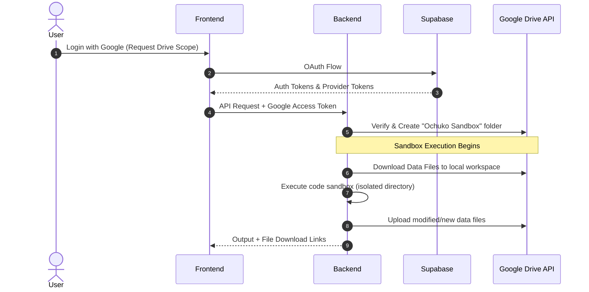

# Feasibility Study: Google Drive Sandbox Storage & File-Script Isolation

This document evaluates the feasibility of replacing Cloudflare R2/local storage with the user's own **Google Drive** for sandbox file storage, alongside implementing a clean separation in the execution sandbox to prevent confusion between user data files and agent code scripts.

---

## 1. Google Drive Storage Feasibility

### Architecture Overview
Instead of storing user-uploaded and agent-generated files on centralized Cloudflare R2 storage, Ochuko will read/write files directly from/to a dedicated folder (e.g., `Ochuko Sandbox`) in the user's Google Drive. 



### Technical Feasibility Analysis

| Metric / Dimension | Feasibility Rating | Details & Implementation Notes |
| :--- | :--- | :--- |
| **Authentication (OAuth2)** | **High** | Supabase OAuth supports requesting additional scopes natively during login (e.g. `https://www.googleapis.com/auth/drive.file` to limit access only to files created by the app). |
| **Token Management** | **Medium** | Need to store Google refresh tokens securely. Supabase Auth stores provider tokens, but to access them server-side on-demand, we can write a database trigger to copy provider tokens to a secure `user_credentials` table (encrypted). |
| **API Latency** | **Medium-Low** | Google Drive API is significantly slower than Cloudflare R2/S3. Direct sync on every code run would add 1–3s overhead. **Mitigation:** Implement a local cache in the sandbox directory and sync files back to Google Drive asynchronously or on-demand. |
| **Path Mapping** | **Medium** | Google Drive is ID-based, not path-based. Multiple files with the same name can exist in a folder. **Mitigation:** Maintain a metadata mapping or look up files strictly by name inside the application-specific `Ochuko Sandbox` folder. |

### Pros & Cons of Google Drive Storage

> [!NOTE]
> **Pros:**
> * **Zero Storage Costs:** Storage uses the user's free 15 GB quota instead of project-funded R2 storage.
> * **Direct Accessibility:** Users can inspect, edit, or delete sandbox files directly in their Google Drive UI.
> * **Enhanced Privacy:** Files are hosted on the user's personal storage domain, complying with strict enterprise data boundaries.

> [!WARNING]
> **Cons:**
> * **Setup Overhead:** Requires setting up a Google Cloud Console OAuth Consent Screen and getting approval or keeping the app in "Testing" mode.
> * **Token Expirations:** If the user revokes access or the refresh token expires, the sandbox loses access.

---

## 2. File-Script Separation inside the Sandbox

Currently, the code sandbox mounts all uploaded files directly into the root folder (`./`), which mixes user data (CSVs, PDFs) with script code (`script.py`, `script.js`). This causes model confusion and results in internal scripts being uploaded back to R2 as generated outputs.

### Proposed Isolation Design

We will enforce a strict directory boundary inside the sandbox container/workspace:

```
/workspace/
├── src/
│   ├── script.py         <-- The code generated by the agent
│   └── script.js
└── data/
    ├── input_data.csv    <-- Mounted user files (Read-Only)
    └── result_chart.png  <-- Generated output files (Read-Write)
```

1. **Model Awareness & Prompts:**
   * Modify the system prompt to instruct the model:
     > [!IMPORTANT]
     > All user data files are placed in the `./data/` folder. Your scripts must be written in the `./src/` folder. If your code needs to read or write files, always prefix the file path with `../data/` or `./data/`. Do not pollute the root directory.
2. **Mounting Logic:**
   * The backend mounts files from Google Drive (or R2) strictly to the `/workspace/data/` folder.
3. **Upload Logic:**
   * After execution, the backend scans **only** `/workspace/data/` for new/modified files to sync back to Google Drive. The `/workspace/src/` folder is ignored, preventing code scripts from being uploaded.

---

## 3. Verdict
**Yes, it is highly feasible.** The OAuth token extraction and Google Drive API integrations are standard procedures, and the directory segregation resolves path confusion and prevents script pollution.
