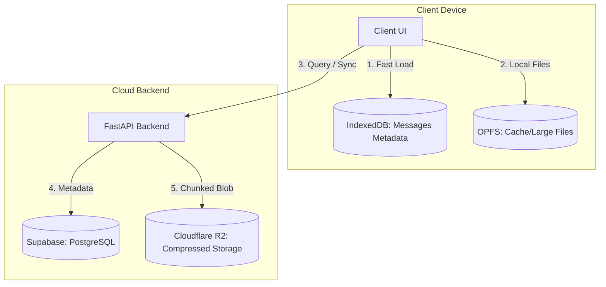

# Architectural Design: Hybrid Chat Storage & Compute Distribution

This document outlines how chat history, session data, and generated files are stored, retrieved, and processed. It explains how local-first caching is balanced with cloud storage to maintain reliability, speed, and low infrastructure costs.

---

## 1. Storage Architecture Overview

We implement a **Local-First, Cloud-Synced** storage model. The data is segregated by size, sensitivity, and access patterns:



### Data Segregation Table

| Data Type | Primary Location | Sync/Backup | Compression |
| :--- | :--- | :--- | :--- |
| **Chat Metadata & Structure** | IndexedDB (Client) | Supabase PostgreSQL | None (SQL Indexed) |
| **Highly Compressible Files** | OPFS (Client) | Cloudflare R2 | **Gzip** (on-the-fly) |
| **Large Binaries / Media** | OPFS (Client) | Original Source / R2 (Short TTL) | None (Lazy Loaded) |

---

## 2. Where is Compute Demanded? (Supabase vs. Backend vs. Client)

To maintain database performance and reliability at scale, we enforce strict compute boundaries:

### A. Database Layer (Supabase PostgreSQL) — *Zero File Compute*
* **What it does**: Handles structured queries, indexing, and user state mapping.
* **What it NEVER does**: It **never** decompresses files, decrypts large text buffers, or runs heavy operations. Keeping Postgres lightweight ensures sub-millisecond query responses.

### B. Backend API (FastAPI Container) — *Orchestration & Streaming*
* **What it does**:
  - Validates authentication tokens symmetrically (`HS256`).
  - Fetches compressed raw bytes from R2.
  - Compresses generated text outputs using **Gzip** before uploading to R2.
  - Proxies/streams external files chunk-by-chunk to save RAM.

### C. Client Layer (Browser/Device) — *Decompression & Lazy Hydration*
* **What it does**:
  - Standard decompression of downloaded Gzip assets (handled natively by the browser engine).
  - Lazy loading of past chat histories. When a past chat is opened, the client retrieves the structure locally from IndexedDB. If assets/attachments are missing locally, the client requests them from R2 on demand (lazy hydration).

---

## 3. Session Switching & Transition Locks

To prevent data corruption, state race conditions, and UI stuttering during active LLM inference or code execution:

* **Inference Lock**: While a chat session is actively streaming tokens or executing a code block inside the sandbox, **transition state locks are active**.
* **Transition Queueing**: Clicking another chat in the sidebar will not force-terminate the active sandbox session or disrupt the socket stream. The active session continues running and completes its current turn before the client UI processes the transition to the newly clicked chat session.

---

## 4. Past Chat Restoration Flow

When a user selects a past conversation from the sidebar:

1. **Local Check**: The UI queries IndexedDB/local storage for the message structure and metadata of the selected conversation.
2. **Structural Render**: The chat layout (names, timestamps, message layout) renders **instantly** (0ms network cost).
3. **Lazy Asset Retrieval**: 
   - File attachment cards are rendered in an **idle state** (0-byte footprint).
   - If the user clicks on a file card, the client first attempts to load it from the Origin Private File System (OPFS).
   - If not present in OPFS, the client calls the backend API `/download-proxy` or fetches it from R2, downloads it, and saves a local copy in OPFS.

---

## 5. Cloudflare R2 — Current State

**R2 is the binary storage layer — Supabase carries zero file data.**

Supabase PostgreSQL stores only metadata rows (file records, job rows, message references). All binary content — user uploads, generated files, AI images — lives in Cloudflare R2.

| Component | File | Role |
| :--- | :--- | :--- |
| Presigned upload URL generator | `backend/app/services/cloudflare_r2.py` | Issues time-limited PUT URLs for direct client → R2 uploads |
| Download URL construction | `backend/app/api/v1/endpoints/files.py` | Builds public CDN URLs using `R2_PUBLIC_DOMAIN` env var |
| Sandbox output upload | `backend/app/services/code_sandbox.py` | Uploads generated files (charts, CSVs, ZIPs) after code execution |
| AI image upload | `backend/app/api/v1/endpoints/agents.py` | Uploads FLUX-generated images after job completion |

**Current bucket:** Single bucket `agent-ochuko-storage` on one Cloudflare account.

**Current env vars:**

```
R2_ACCESS_KEY_ID=<key>
R2_SECRET_ACCESS_KEY=<secret>
R2_ENDPOINT=https://<account_id>.r2.cloudflarestorage.com
R2_BUCKET_NAME=agent-ochuko-storage
R2_PUBLIC_DOMAIN=https://pub-<hash>.r2.dev
```

---

## 6. R2 Expansion Plan — 5 New Keys (Shard by Content Type)

When the 5 additional Cloudflare API keys arrive, storage will be sharded by content type. Each content type gets its own R2 bucket on its own Cloudflare account, providing:

- **Isolated quotas** — generated files don't eat into user upload free tier
- **Independent CDN domains** — different cache TTLs per content type
- **Cost visibility** — per-bucket billing breakdown by type

### Bucket Map

| # | Bucket Name | Content | Env Prefix |
| :--- | :--- | :--- | :--- |
| 1 | `ochuko-user-uploads` | User file uploads (PDFs, images, docs) | `R2_UPLOADS_*` ← **current key** |
| 2 | `ochuko-generated` | Sandbox output (charts, CSVs, ZIPs, PNGs from code) | `R2_GENERATED_*` ← new key 1 |
| 3 | `ochuko-images` | FLUX AI-generated images | `R2_IMAGES_*` ← new key 2 |
| 4 | `ochuko-exports` | User-exported reports and documents | `R2_EXPORTS_*` ← new key 3 |
| 5 | `ochuko-backups` | Conversation export backups | `R2_BACKUPS_*` ← new key 4 |

> **Key 5** is held in reserve for future data type or geographic shard.

### New Env Var Schema (per bucket)

Each bucket follows this naming pattern (replace `{TYPE}` with `UPLOADS`, `GENERATED`, `IMAGES`, `EXPORTS`, `BACKUPS`):

```
R2_{TYPE}_ACCESS_KEY_ID
R2_{TYPE}_SECRET_ACCESS_KEY
R2_{TYPE}_ENDPOINT
R2_{TYPE}_BUCKET_NAME
R2_{TYPE}_PUBLIC_DOMAIN
```

Example for generated files bucket:
```
R2_GENERATED_ACCESS_KEY_ID=...
R2_GENERATED_SECRET_ACCESS_KEY=...
R2_GENERATED_ENDPOINT=https://<account2_id>.r2.cloudflarestorage.com
R2_GENERATED_BUCKET_NAME=ochuko-generated
R2_GENERATED_PUBLIC_DOMAIN=https://pub-<hash2>.r2.dev
```

### Cloudflare R2 Free Tier (per account)

| Resource | Free Allowance | Overage |
| :--- | :--- | :--- |
| Storage | 10 GB/month | $0.015/GB |
| Class A ops (writes, lists) | 1M/month | $4.50/M |
| Class B ops (reads) | 10M/month | $0.36/M |
| Egress | **Free** (no egress fees) | — |

5 accounts = **50 GB free storage** + **5M free writes/month** + **50M free reads/month**.

---

## 7. Code Changes Required When Keys Arrive

No code changes are needed now. The architecture is ready. When keys arrive, one developer pass (~1 hour) wires the shard config:

### `backend/app/services/cloudflare_r2.py`
- Add `get_r2_client(bucket_prefix: str)` that reads `R2_{prefix}_*` env vars
- Keep `generate_r2_upload_url()` working with `R2_UPLOADS_*` (backward compatible)
- Add `upload_bytes_to_bucket(bucket_prefix, key, data, content_type)` for server-side uploads

### `backend/app/services/code_sandbox.py`
- Change generated file upload to use `R2_GENERATED_*` bucket
- Currently: uses primary bucket env vars

### `backend/app/api/v1/endpoints/agents.py`
- Change FLUX image upload to use `R2_IMAGES_*` bucket
- Currently: uses `R2_ENDPOINT` / primary bucket

### `backend/app/api/v1/endpoints/files.py`
- Keep user uploads on `R2_UPLOADS_*` (no change needed here)
- Update download URL construction to select the correct `R2_{TYPE}_PUBLIC_DOMAIN` based on file type

### Azure App Configuration / `.env`
- Add the 10 new env vars (5 buckets × access key + secret per bucket)
- Remaining 3 vars per bucket (endpoint, bucket name, domain) can be hard-coded or in App Config

---

*Last updated: 2026-07-17 — R2 expansion architecture designed, awaiting 5 Cloudflare API keys to execute wire-up.*
