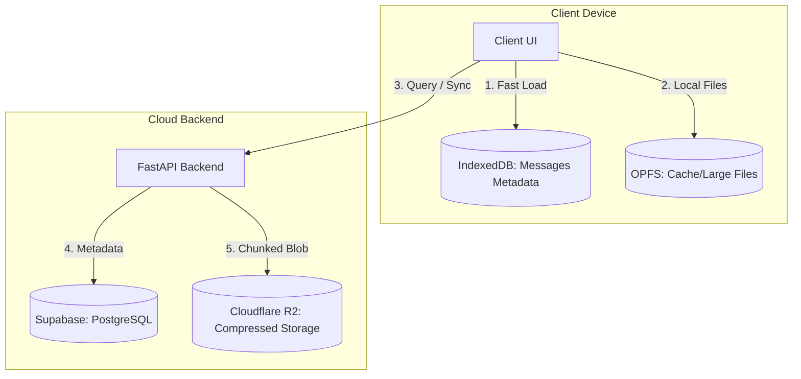

# Architectural Design: Hybrid Chat Storage & Compute Distribution

This document outlines how chat history, session data, and generated files are stored, retrieved, and processed. It explains how local-first caching is balanced with cloud storage to maintain reliability, speed, and low infrastructure costs.

---

## 1. Storage Architecture Overview

We implement a **Local-First, Cloud-Synced** storage model. The data is segregated by size, sensitivity, and access patterns:

### Data Segregation Table

| Data Type | Primary Location | Sync/Backup | Compression |
| :--- | :--- | :--- | :--- |
| **Chat Metadata & Structure** | IndexedDB (Client) | Supabase PostgreSQL | None (SQL Indexed) |
| **Highly Compressible Files** | OPFS (Client) | Cloudflare R2 | **Gzip** (on-the-fly) |
| **Large Binaries / Media** | OPFS (Client) | Original Source / R2 (Short TTL) | None (Lazy Loaded) |

---

## 2. Where is Compute Demanded? (Supabase vs. Backend vs. Client)

To maintain database performance and reliability at scale, we enforce strict compute boundaries:

### A. Database Layer (Supabase PostgreSQL) — *Zero File Compute*
* **What it does**: Handles structured queries, indexing, and user state mapping.
* **What it NEVER does**: It **never** decompresses files, decrypts large text buffers, or runs heavy operations. Keeping Postgres lightweight ensures sub-millisecond query responses.

### B. Backend API (FastAPI Container) — *Orchestration & Streaming*
* **What it does**:
  - Validates authentication tokens symmetrically (`HS256`).
  - Fetches compressed raw bytes from R2.
  - Compresses generated text outputs using **Gzip** before uploading to R2.
  - Proxies/streams external files chunk-by-chunk to save RAM.

### C. Client Layer (Browser/Device) — *Decompression & Lazy Hydration*
* **What it does**:
  - Standard decompression of downloaded Gzip assets (handled natively by the browser engine).
  - Lazy loading of past chat histories. When a past chat is opened, the client retrieves the structure locally from IndexedDB. If assets/attachments are missing locally, the client requests them from R2 on demand (lazy hydration).

---

## 3. Session Switching & Transition Locks

To prevent data corruption, state race conditions, and UI stuttering during active LLM inference or code execution:

* **Inference Lock**: While a chat session is actively streaming tokens or executing a code block inside the sandbox, **transition state locks are active**.
* **Transition Queueing**: Clicking another chat in the sidebar will not force-terminate the active sandbox session or disrupt the socket stream. The active session continues running and completes its current turn before the client UI processes the transition to the newly clicked chat session.

---

## 4. Past Chat Restoration Flow

When a user selects a past conversation from the sidebar:

1. **Local Check**: The UI queries IndexedDB/local storage for the message structure and metadata of the selected conversation.
2. **Structural Render**: The chat layout (names, timestamps, message layout) renders **instantly** (0ms network cost).
3. **Lazy Asset Retrieval**: 
   - File attachment cards are rendered in an **idle state** (0-byte footprint).
   - If the user clicks on a file card, the client first attempts to load it from the Origin Private File System (OPFS).
   - If not present in OPFS, the client calls the backend API `/download-proxy` or fetches it from R2, downloads it, and saves a local copy in OPFS.
